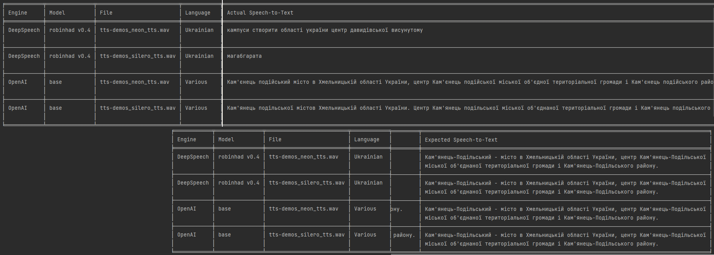

# Python Speech To Text
The scripts in this repository demonstrate modern offline speech to text capabilities using pre-trained language models.

* OpenAI provides accurate translations and additional features.
  * It is offline and free to use.
## Neural Network Models
## [Multilingual](./Neural%20Network%20Models/README.md#Multilingual)
* [OpenAI's Whisper](https://openai.com/blog/whisper/)
## [Ukrainian](./Neural%20Network%20Models/README.md#Ukrainian)
### robinhad/voice-recognition-ua
* [Mozilla DeepSpeech](https://openai.com/blog/whisper/)