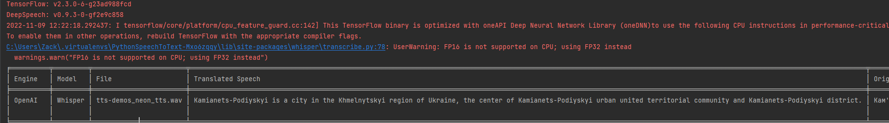
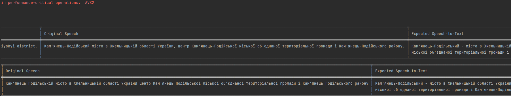
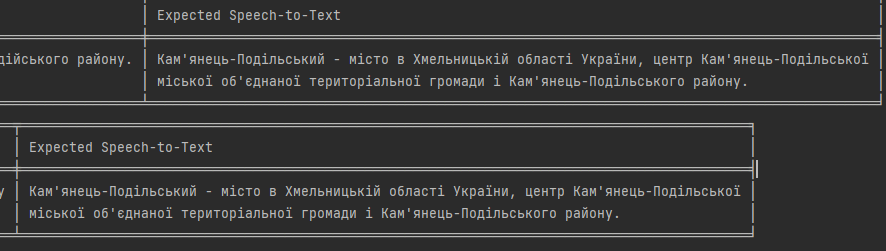

# Python Speech To Text
* **STATUS:** *Completed and refactoring to an OOP model and improving Python syntax and convention*

## Demo Results

### Markdown Table
| Engine | Model   | File                     | Translated Speech                                                                                                                                                             | Detected Speech                                                                                                                                                  | Expected Speech                                                                                                                                                      |
|--------|---------|--------------------------|-------------------------------------------------------------------------------------------------------------------------------------------------------------------------------|------------------------------------------------------------------------------------------------------------------------------------------------------------------|----------------------------------------------------------------------------------------------------------------------------------------------------------------------|
| OpenAI | Whisper | tts-demos_neon_tts.wav   | Kamianets-Podiyskyi is a city in the Khmelnytskyi region of Ukraine, the center of Kamianets-Podiyskyi urban united territorial community and Kamianets-Podiyskyi district.   | Кам'янець-Подійський місто в Хмельницькій області України, центр Кам'янець-Подійської міської об'єднаної територіальної громади і Кам'янець-Подійського району.  | Кам'янець-Подільський - місто в Хмельницькій області України, центр Кам'янець-Подільської міської об'єднаної територіальної громади і Кам'янець-Подільського району. | 
| OpenAI | Whisper | tts-demos_silero_tts.wav | Kamianets Podilska city in Khmelnytskyi region of Ukraine Center of Kamianets Podilska city united territorial community and Kamianets Podilska district                      | Кам'янець Подільській місто в Хмельницькій області України Центр Кам'янець Подільської міської об'єднаної територіальної громади і Кам'янець Подільського району | Кам'янець-Подільський - місто в Хмельницькій області України, центр Кам'янець-Подільської міської об'єднаної територіальної громади і Кам'янець-Подільського району. |

### Screenshots of Console

## Neural Network Models
## [Multilingual](./Neural%20Network%20Models/README.md#Multilingual)
* [OpenAI's Whisper](https://openai.com/blog/whisper/)
## [Ukrainian](./Neural%20Network%20Models/README.md#Ukrainian)
### robinhad/voice-recognition-ua
* [Mozilla DeepSpeech](https://openai.com/blog/whisper/)
